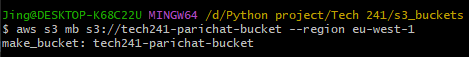
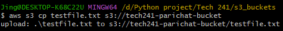
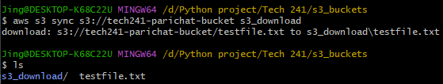
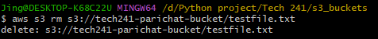
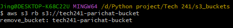

# Amazon S3 
## Using AWS CLI
_The region is switched to global and viewable in global even a bucket is created in a specific region_
1) Install CLI
   ```bash
   pip install awscli
   ```
2) Login 
   ```bash
   aws configure
   ``` 
3) Check a list of buckets
   ```bash
   aws s3 ls    
   ``` 

#### Create a S3 bucket
`mb` is make bucket
```bash
aws s3 mb s3://<bucket-name> --region eu-west-1
```
```bash
aws s3 mb s3://tech241-parichat-bucket --region eu-west-1
```


#### Upload a file to S3 bucket
```bash
aws s3 cp <file-you-want-to-upload> s3://tech241-parichat-bucket
```
```bash
aws s3 cp testfile.txt s3://tech241-parichat-bucket
```


#### Download a file from the s3 bucket, it downloads as a folder
```bash
aws s3 sync s3://tech241-parichat-bucket <folder-name>
```
```bash
aws s3 sync s3://tech241-parichat-bucket s3_download
```


#### Delete item(s) in the s3 bucket
**Delete an item**
```bash
aws s3 rm s3://tech241-parichat-bucket/<file-you-want-to-delete>
```
```bash
aws s3 rm s3://tech241-parichat-bucket/testfile.txt
```
**Delete everything in the bucket**
```bash
aws s3 rm s3://tech241-parichat-bucket --recursive
```


#### Delete a s3 bucket
```bash
aws s3 rb s3://tech241-parichat-bucket
```


## Using Python scripts
#### Create a s3 bucket
```python
# first thing is to import boto3 library
import boto3

# set up a s3 connection
s3 = boto3.client('s3')

# create a bucket in the eu-west-1 region
bucket_name = s3.create_bucket(Bucket="tech241-parichat-python-bucket", CreateBucketConfiguration={"LocationConstraint":"eu-west-1"})

# print the bucket name to confirm working script
print(bucket_name)
```

#### Upload to s3 bucket
```python
import boto3

# set up a s3 connection
s3 = boto3.client('s3')

# create a variable for the bucket
bucket_name = "tech241-parichat-python-bucket"

# Upload a file to the bucket
bucket_content = s3.upload_file("testfile.txt", bucket_name, "testfile2.txt")
print(bucket_content)
```

#### Download a file from a s3 bucket
```python
import boto3

# s3 connection
s3 = boto3.client('s3')

# create a variable for the bucket
bucket_name = "tech241-parichat-python-bucket"

# download a file
s3.download_file(bucket_name, "testfile2.txt", "download_file.txt")
print(s3.download_file)
```

#### Delete a file in a s3 bucket
```python
import boto3

s3 = boto3.client('s3')

response = s3.delete_object(Bucket="tech241-parichat-python-bucket", Key="testfile2.txt")

print(response)
```

#### Delete an empty
```python
import boto3

s3 = boto3.resource('s3')

bucket = s3.Bucket("tech241-parichat-python-bucket")
response = bucket.delete()

print(response)
```
